# ELT Pipeline with Azure Data Factory & Databricks  


## Introduction
This Data Engineering project consists of developing a data pipeline that consumes raw data from an API, applies transformations and standardization, and makes the data available for analytical consumption.  
It uses Microsoft Azure services and follows best development practices.

---

## Objectives
This project has two main objectives:

- **Personal Goal**: put into practice data engineering knowledge, document each step of the implementation, and share the results with the community.  
- **Final Delivery Goal**: deliver clean and standardized data into a Data Warehouse ready for consumption and analysis.

---

## Project Architecture Overview

<p align="center">
  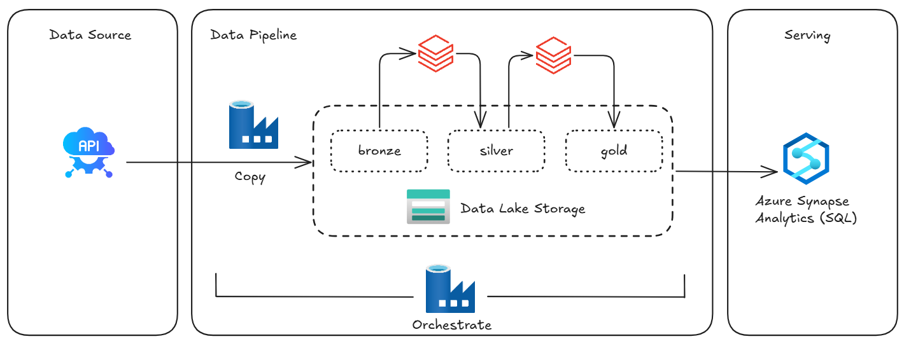<br>
  <em>Figure 1: Project Architecture</em>
</p>


---

## 📂 Repository Structure

```
├─ 📂 data-factory
│  ├─ 📂 dataset
│  │  ├─ ds_datalake_historical.json
│  │  ├─ ds_datalake_profile.json
│  │  ├─ ds_fmp_historical.json
│  │  ├─ ds_fmp_profile.json
│  │  ├─ ds_gold_dim_company.json
│  │  ├─ ds_gold_fact_quote.json
│  │  ├─ ds_synapse_dim_company.json
│  │  └─ ds_synapse_fact_quote.json
│  ├─ 📂 factory
│  │  └─ df-elt-project.json
│  ├─ 📂 linkedServices
│  │  ├─ ls_databricks_ws.json
│  │  ├─ ls_datalake_gold.json
│  │  ├─ ls_datalake_raw.json
│  │  ├─ ls_fmp_api.json
│  │  ├─ ls_keyvault.json
│  │  └─ ls_synapse_dpool.json
│  ├─ 📂 pipeline
│  │  └─ publish_config.json 
├─ 📂 databricks
│  │  ├─ Bronze_to_Silver.ipynb
│  │  ├─ Silver_To_Gold.ipynb
│  │  ├─ Validation_Gold.ipynb
│  │  ├─ Copy_To_Synapse_dim_company.ipynb
│  │  └─ Copy_To_Synapse_fact_quote.ipynb
├─ 📂 docs
└─ README.md
```
---

## Tools Used
-  **Azure Data Factory** → Data orchestration  
-  **Azure Databricks (PySpark)** → Data transformations  
-  **Azure Synapse** → Analytic Warehouse  
- 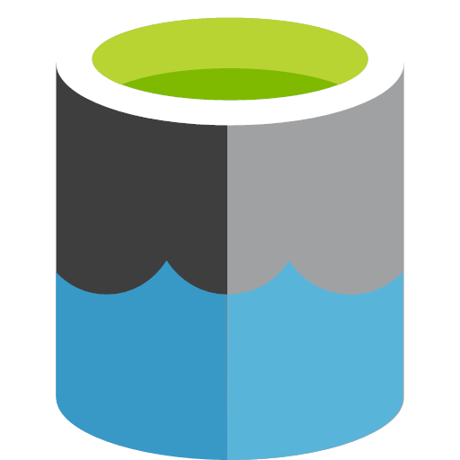 **Azure Data Lake Storage Gen2** → Storage (Bronze, Silver, Gold layers)  
-  **Azure Key Vault** → Secrets management  

---

## Step-by-Step Implementation

### 1. Define an API for the project
The first step was to choose an API to consume data from.  
I selected the **Financial Modeling Prep (FMP)** API because its **Basic Plan** is free and meets the project needs (historical stock price data). 

<p align="center">
  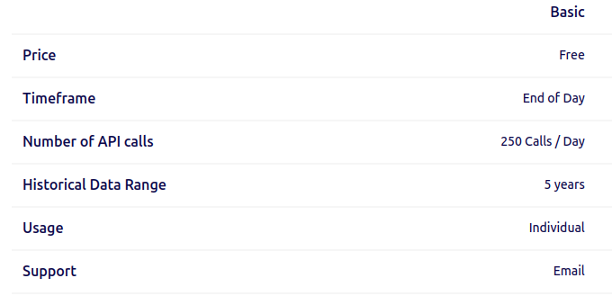<br>
  <em>Figure 2: API Basic plan</em>
</p>

After reading the documentation and understanding its endpoints, I registered on the website to obtain an **API Key**.  

---

### 2. Create Azure Resources
Inside Microsoft Azure, the necessary resources were created within a Resource Group.  
This Resource Group served as a container for all services used in the project. By grouping the resources together, it was easier to manage access, monitor costs, and keep the environment organized.

<p align="center">
  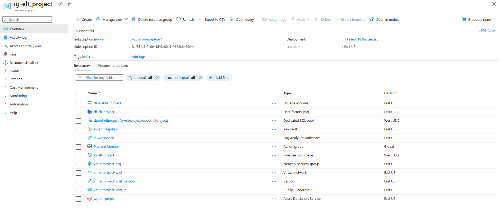<br>
  <em>Figure 3: Resource Group</em>
</p>

#### Storage Account (Data Lake) 
Data is stored in an **Azure Data Lake Storage Gen2** using the **medallion architecture**:

<p align="center">
  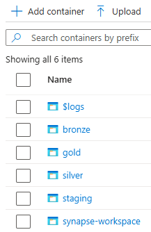<br>
  <em>Figure 4: Storage layers</em>
</p>

- **Bronze**: raw data directly from the source. 

<p align="center">
  <br>
  <em>Figure 5: Bronze folders</em>
</p>
 
- **Silver**: cleaned and standardized data (duplicates removed, column names standardized, column types validated).  

<p align="center">
  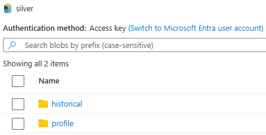<br>
  <em>Figure 6: Silver folders</em>
</p>

- **Gold**: enriched data with business metrics. 

<p align="center">
  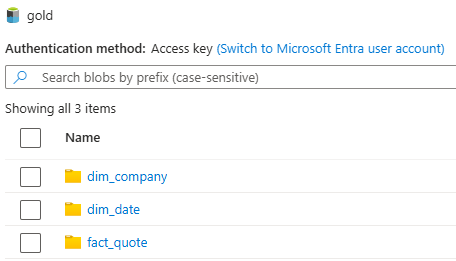<br>
  <em>Figure 7: Gold folders</em>
</p>

Additionally, a **Staging Layer** was created to move data from the Gold layer into **Azure Synapse** using **Databricks**.

<p align="center">
  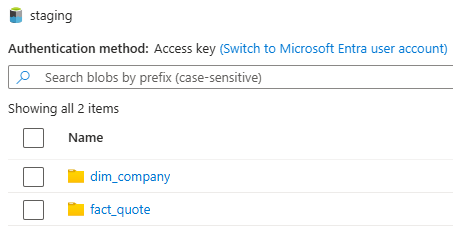<br>
  <em>Figure 8: Staging Synapse</em>
</p>

#### Synapse 
- A **Dedicated SQL Pool** was created.  
- Tables and a **stored procedure** were implemented to populate the `dim_date` table.  

<p align="center">
  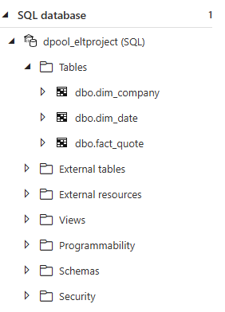<br>
  <em>Figure 9: Synapse tables</em>
</p>

#### Key Vault  
For data security, **Azure Key Vault** was used to securely store sensitive information, such as the API Key and Synapse credentials.  

<p align="center">
  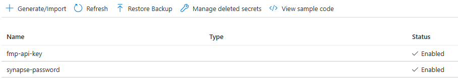<br>
  <em>Figure 10: Key Vault secrets</em>
</p>

#### Databricks 
- A low-cost cluster was created (since this is a personal project).  

<p align="center">
  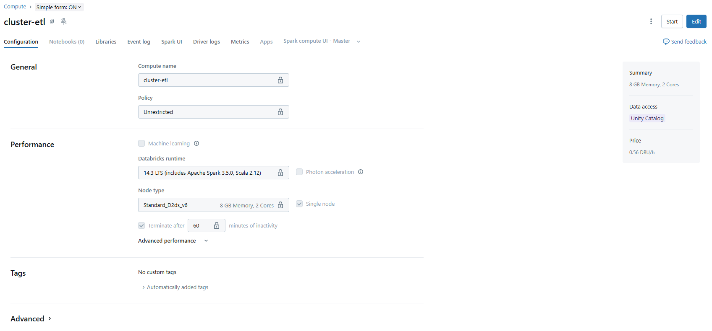<br>
  <em>Figure 11: Databricks cluster</em>
</p>

- Databricks was used to process and move data across the Bronze → Silver → Gold → Synapse layers.  
- To connect Databricks with the Data Lake, credentials were stored securely using **Databricks Secret Scope**, following [this documentation](https://learn.microsoft.com/en-us/azure/databricks/security/secrets/example-secret-workflow).  

Nootebooks:
- [Bronze_to_Silver.ipynb](databricks/Bronze_to_Silver.ipynb): Data exploration, standardization, and cleaning.  
- [Silver_To_Gold.ipynb](databricks/Silver_To_Gold.ipynb): Data enrichment.  
- [Validation_Gold.ipynb](databricks/Validation_Gold.ipynb): Validation to ensure Gold data consistency.  
- [Copy_To_Synapse_dim_company.ipynb](databricks/Copy_To_Synapse_dim_company.ipynb): Moves `dim_company` from Gold to Synapse.  
- [Copy_To_Synapse_fact_quote.ipynb](databricks/Copy_To_Synapse_fact_quote.ipynb): Moves `fact_quote` from Gold to Synapse.  

---

### 3. Data Factory (Orchestration) 
Azure Data Factory was used to orchestrate the pipeline, ensuring automation and monitoring.

Steps:
1. **Linked Services** → Connections to external data sources and compute services. They define *how* Data Factory connects to the resources.  

<p align="center">
  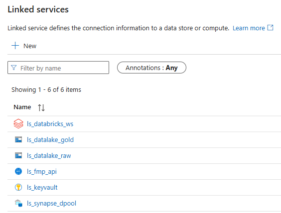<br>
  <em>Figure 12: Data Factory - Linked Services</em>
</p>

2. **Datasets** → Representations of data structures within the linked data stores. They point to specific files, tables, or folders and are used as inputs and outputs in Data Factory activities.  

<p align="center">
  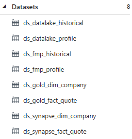<br>
  <em>Figure 13: Data Factory - Datasets</em>
</p>

3. **Pipeline Flow** → Orchestrated sequence of activities:  
   - Retrieve API Key from Key Vault  
   - Ingest API data into the Bronze layer  
   - Process Bronze → Silver with Databricks  
   - Process Silver → Gold with Databricks  
   - Validate Gold data with Databricks  
   - Execute stored procedure for `dim_date`  
   - Ingest Gold data into Synapse with Databricks  

<p align="center">
  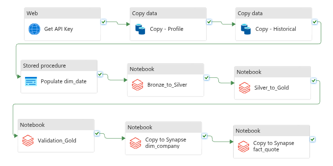<br>
  <em>Figure 14: Data Factory - Pipeline</em>
</p>

---
## Results
The project successfully delivers **clean and analysis-ready data** stored in **Azure Synapse**.  
This allows quick, reliable, and business-oriented analytics.  

The images below demonstrate the results obtained, with the tables properly populated in Synapse:

<p align="center">
  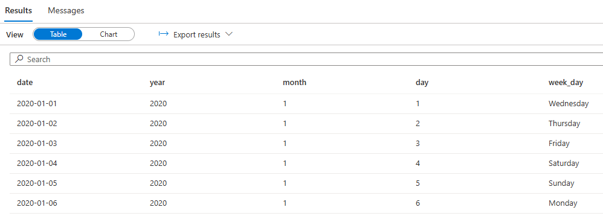<br>
  <em>Figure 15: Table dim_date</em>
</p>

<p align="center">
  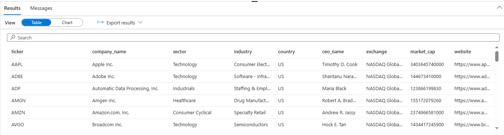<br>
  <em>Figure 16: Table dim_company</em>
</p>

<p align="center">
  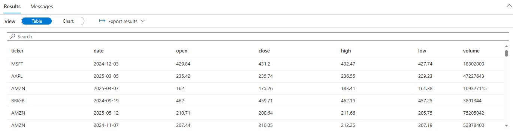<br>
  <em>Figure 17: Table fact_quote</em>
</p>

---

## Conclusion
Both goals were achieved:  
- Raw data was collected, processed, and stored in a Data Warehouse.  
- Knowledge gained from studies, documentation, tutorials, and videos was applied and documented.  

This project also serves as a **knowledge-sharing resource** for the Data Engineering community.  

---

## Next Steps
To improve this project, possible extensions include:
- Connecting Synapse to **Power BI** for interactive reports.  
- Exploring logging and monitoring tools for pipeline observability.  
- Adding new data sources.  

---

## References

- [Azure Databricks Documentation](https://learn.microsoft.com/pt-br/azure/databricks/) 
- [Azure Data Factory Documentation](https://learn.microsoft.com/en-us/azure/data-factory/)  
- [Azure Data Factory - Use Key Vault](https://learn.microsoft.com/en-us/azure/data-factory/how-to-use-azure-key-vault-secrets-pipeline-activities)  
- [Azure Data Lake Storage Documentation](https://learn.microsoft.com/en-us/azure/storage/blobs/data-lake-storage-introduction)  
- [Azure Synapse Documentation](https://learn.microsoft.com/en-us/azure/synapse-analytics/)  
- [Azure Key Vault Documentation](https://learn.microsoft.com/en-us/azure/key-vault/)  
- [Databricks Secrets Documentation](https://docs.databricks.com/aws/en/security/secrets/example-secret-workflow)  
- [DP-700T00 Microsoft Training](https://learn.microsoft.com/en-us/training/courses/dp-700t00)  
- [Financial Modeling Prep API](https://site.financialmodelingprep.com/developer/docs/stable)  


## Author

- [GabrielSCamba](https://github.com/GabrielSCamba)
